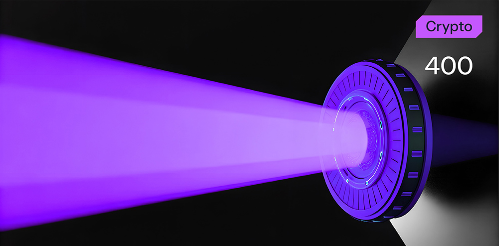

# Time Anomaly



**Формат флага/Flag format**: solar{}

**Файлы/Files**: [anomaly.zip](anomaly.zip)

**Описание**: Агент, использовавший псевдоним "Хронос", отправлял зашифрованные сообщения через временные узлы. Его шифр невозможно было взломать обычными методами - все из-за нестабильного генератора, основанного на времени отправки.

**Description**: An agent using the pseudonym "Chronos" sent encrypted messages via time nodes. His cipher was impossible to crack by conventional methods - all because of an unstable generator based on the time of sending.

**Идея задачи**:

Использование старой версии MSVC rand (значения 0x343FD + 0x269EC3) в шифре sandclock.

**Problem idea**:

Using an old version of MSVC rand (values 0x343FD + 0x269EC3) in the sandclock cipher.

**Решение**:

Можно внимательно проанализировать перехваченное сообщение:
```
===== INTERCEPTED MESSAGE =====

Timestamp:
2265-04-04T13:37Z

Message: 
moaNI8MlI67z/+ylaZSlRxN9knS+rUYBaMwbh5Hq

Note:
He, who watches the hourglass will understand: moments repeat in an eternal circle. 
Finf the starting point that can be returned to again and again, and use it to unravel the mystery.
```

И понять, что есть какой-то timestamp (который в дальнейшем понадобится).

Также можно обратить внимание, что текст сообщения закодирован в base64, но просто его раскодировать нам ничего не даст, надо еще подумать.

Дальше можно сопоставить timestamp, покопаться в интернете и найти статьи, в которых описывается что-то похожее, что описывается в сообщении и наткнуться на старую функция MSVC rand.

Далее нужно написать скрипт дешифровки и получим результат:

```
import base64
 
def sandclock(seed):
    state = seed % (2**32)
    while True:
        state = (state * 0x343FD + 0x269EC3) & 0xFFFFFFFF
        yield (state >> 16) & 0xFF

timestamp = "2265-04-04T13:37Z"
seed_str = "226504041337"
seed = int(seed_str)
 
ciphertext_b64 = ""

with open('cipher.txt', 'r') as f:
    ciphertext_b64 = f.read()

ciphertext = base64.b64decode(ciphertext_b64)
print(ciphertext)

stream = sandclock(seed)
text = bytes([c ^ next(stream) for c in ciphertext])

print(text.decode())
```
Флаг: solar{t1m3_p0W3R3d_str3am_x0r}

**Solution**:

You can carefully analyze the intercepted message:
```
===== INTERCEPTED MESSAGE =====

Timestamp:
2265-04-04T13:37Z

Message:
moaNI8MlI67z/+ylaZSlRxN9knS+rUYBaMwbh5Hq

Note:
He who watches the hourglass will understand: moments repeat in an eternal circle.
Finf the starting point that can be returned to again and again, and use it to unravel the mystery.
```

And understand that there is some timestamp (which will be needed later).

You can also note that the message text is encoded in base64, but simply decoding it will not give us anything, we need to think more.

Next, you can compare the timestamp, dig around on the Internet and find articles that describe something similar to what is described in the message and stumble upon the old MSVC rand function.

Next, you need to write a decryption script and get the result:

```
import base64
 
def sandclock(seed):
    state = seed % (2**32)
    while True:
        state = (state * 0x343FD + 0x269EC3) & 0xFFFFFFFF
        yield (state >> 16) & 0xFF

timestamp = "2265-04-04T13:37Z"
seed_str = "226504041337"
seed = int(seed_str)
 
ciphertext_b64 = ""

with open('cipher.txt', 'r') as f:
    ciphertext_b64 = f.read()

ciphertext = base64.b64decode(ciphertext_b64)
print(ciphertext)

stream = sandclock(seed)
text = bytes([c ^ next(stream) for c in ciphertext])

print(text.decode())
```
Flag: solar{t1m3_p0W3R3d_str3am_x0r}