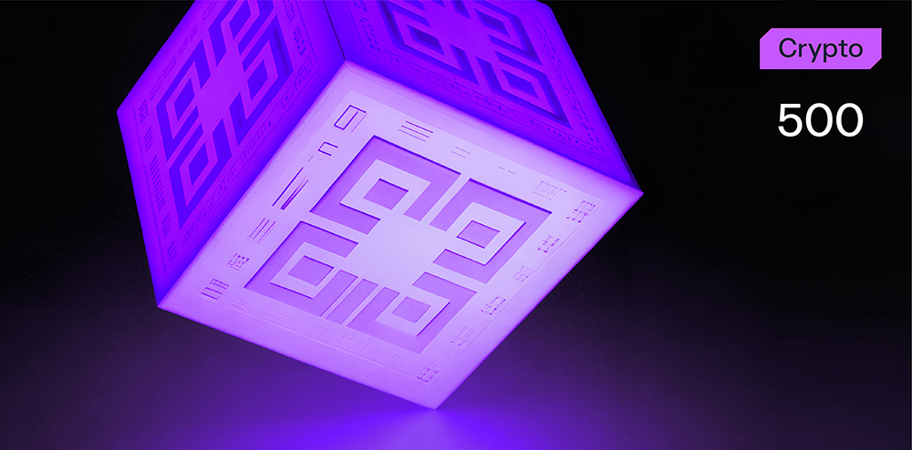

# Masking Madness



**Формат флага/Flag format**: solar{}

**Описание**: Мы зашифровали флаг при помощи нашей кастомной маскировки, основанной на побитовых XOR и циклических сдвигах. Все просто! Никакой AES, никакого RSA. Только легкий битовый хаос. Если ты умеешь распутывать XOR-овую паутину, флаг твой.

**Description**: We encrypted the flag using our custom obfuscation based on bitwise XORs and cyclic chifts. It`s simple! No AES, no RSA. Just a little bit chaos. If you can untangle the XOR web, the flag is yours.

**Идея задачи**:

Флаг зашифрован кастомной функцией вида:

```
cipher = []
state = key
for b in plaintext:
       k = (state ^ ((state << 3) | (state >> 5))) & 0xFF
       c = b ^ k
       cipher.append(c)
       state = (state + b + 0x42) & 0xFF
```

**Problem idea**:

The flag is encrypted with a custom function of the form:

```
cipher = []
state = key
for b in plaintext:
       k = (state ^ ((state << 3) | (state >> 5))) & 0xFF
       c = b ^ k
       cipher.append(c)
       state = (state + b + 0x42) & 0xFF
```

**Решение**:

Из описания можно сделать предположение, что:

- каждый байт зашифрован с помощью XOR с какой-то маской;
- маска генерируется от некоего state;
- state меняется от байта к байту.

То есть получается что-то вроде:

```
    cipher[i] = plaintext[i] ^ mask[i],
    где mask[i] = f(state[i])
```

Известен шаблон флага: solar{ - первые 6 байт известны, что означает:

```
    plaintext[0] = ord(‘s’) = 115
    plaintext[1] = ord(‘o’) = 111
    plaintext[2] = ord(‘l’) = 108
    plaintext[3] = ord(‘a’) = 97
    plaintext[4] = ord(‘r’) = 114
    plaintext[5] = ord(‘{‘) = 123
```

Из этого можем получить первые 6 байт маски:

```
    mask[0] = cipher[0] ^ 115
    mask[1] = cipher[1] ^ 111
    mask[2] = cipher[2] ^ 108
    mask[3] = cipher[3] ^ 97
    mask[4] = cipher[4] ^ 114
    mask[5] = cipher[5] ^ 123
```

Дальше – самое сложное, необходимо подобрать функцию, которая может давать такие значения. Здесь нужно угадать шаблон маски.

Сама маска:

```
    mask = (state ^ ((state << 3) | (state >> 5))) & 0xFF
```

Дополнительно необходимо помнить, что state также меняется от предыдущего символа, это также можно решить методом подбора по известным символам.

```
    state = (state + b + 0x42) ^ 0xFF
```

После того, как все части загадки известны, можно написать функцию, которая расшифрует наш флаг:
```
def decrypt(cipher, key_guess):
    state = key_guess
    plain = []
    for c in cipher:
        k = (state ^ ((state << 3) | (state >> 5))) & 0xFF
        b = c ^ k
        plain.append(b)
        state = (state + b + 0x42) & 0xFF
    return bytes(plain)

with open("encrypted.txt") as f:
    cipher = list(map(int, f.read().split()))

for key_guess in range(256):
    pt = decrypt(cipher, key_guess)
    if pt.startswith(b"solar{"):
        print("[+] Key:", key_guess)
        print("[+] Flag:", pt.decode())
        break
_______________________________________
[+] Key: 80
[+] Flag: solar{b1t_tw1st_m@sk1ng_1s_fun}
```

**Solution**:

From the description we can assume that:

- each byte is encrypted using XOR with some mask;
- the mask is generated from some state;
- the state changes from byte to byte.

So we get something like:

```
    cipher[i] = plaintext[i] ^ mask[i],
    where mask[i] = f(state[i])
```

The flag pattern is known: solar{ - the first 6 bytes are known, which means:

```
    plaintext[0] = ord(‘s’) = 115
    plaintext[1] = ord(‘o’) = 111
    plaintext[2] = ord(‘l’) = 108
    plaintext[3] = ord(‘a’) = 97
    plaintext[4] = ord(‘r’) = 114
    plaintext[5] = ord(‘{‘) = 123
```

From this we can get the first 6 bytes of the mask:

```
    mask[0] = cipher[0] ^ 115
    mask[1] = cipher[1] ^ 111
    mask[2] = cipher[2] ^ 108
    mask[3] = cipher[3] ^ 97
    mask[4] = cipher[4] ^ 114
    mask[5] = cipher[5] ^ 123
```

Next comes the hardest part, you need to find a function that can give such values. Here you need to guess the mask template.

The mask itself:

```
    mask = (state ^ ((state << 3) | (state >> 5))) & 0xFF
```

Additionally, you need to remember that the state also changes from the previous symbol, this can also be solved by selection based on known symbols.

```
    state = (state + b + 0x42) ^ 0xFF
```

Once all the pieces of the puzzle are known, we can write a function that will decrypt our flag:
```
def decrypt(cipher, key_guess):
    state = key_guess
    plain = []
    for c in cipher:
        k = (state ^ ((state << 3) | (state >> 5))) & 0xFF
        b = c ^ k
        plain.append(b)
        state = (state + b + 0x42) & 0xFF
    return bytes(plain)

with open("encrypted.txt") as f:
    cipher = list(map(int, f.read().split()))

for key_guess in range(256):
    pt = decrypt(cipher, key_guess)
    if pt.startswith(b"solar{"):
        print("[+] Key:", key_guess)
        print("[+] Flag:", pt.decode())
        break
_______________________________________
[+] Key: 80
[+] Flag: solar{b1t_tw1st_m@sk1ng_1s_fun}
```