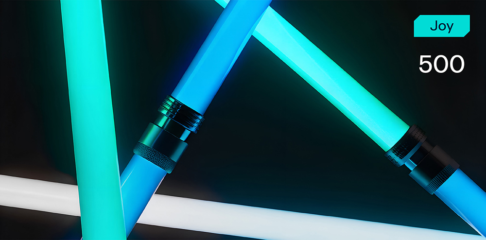

# Solar Traveller



**Формат флага/Flag format**: solar{}

**Файлы/Files**: [travel.zip](travel.zip)

**Описание**: 
Путешественник прошел через десять солнц.
Каждое оставило след на его глазу.
Но чтобы увидеть истину, нужно смотреть не на то, что видит он —
... а на то, что он должен был увидеть.

**Description**: 
The traveler went through ten suns.
Each left a mark on his eye.
But to see the truth, you must not look at what he sees —
...but what he was meant to see.

**Решение**:

Участнику дается несколько файлов, в том числе и генератор .gif файлов, нужно понять как достать из данных файлов флаг.

Необходимо проанализировать файлы, посмотреть как работает генератор, подумать нужен ли он вообще, нужен ли исходный .gif файл вообще или нет, после чего более пристально обратить внимание на pallete_blob, который вроде как в явном виде нигде не используется, но является структурированным.

Далее можно попробовать извлечь из каждого цвета палитры старший бит красного (MSB R), поскольку в генераторе видно, что туда кладут информацию, после чего собрать все биты с кадра в байты и понять, что это символы флага. А дальше просто повторить и получить искомый флаг.

Через скрипт получится что-то вроде:

```
import struct
  
palette_size = 16
frame_count = 20

with open('.palette_blob', 'rb') as f:
    blob = f.read()

flag_bytes = []

for i in range(frame_count):
    palette = []
    for j in range(palette_size):
        offset = (i * palette_size + j) * 3
        r, g, b = struct.unpack('BBB', blob[offset:offset + 3])
        msb = (r & 0b10000000) >> 7
        if j < 8:
            if j == 0:
                bits1 = ''
            bits1 += str(msb)
            if j == 7:
                flag_bytes.append(int(bits1, 2))
        else:
            if j == 8:
                bits2 = ''
            bits2 += str(msb)
            if j == 15:
                flag_bytes.append(int(bits2, 2))
 
flag = bytes(flag_bytes).decode('utf-8', errors='replace')

print(flag)
```

Флаг: solar{p4l3tt3s_ar3_tr4cks}

**Solution**:

The participant is given several files, including a .gif file generator, and needs to understand how to extract a flag from these files.

You need to analyze the files, see how the generator works, think about whether it is needed at all, whether the original .gif file is needed at all or not, and then pay closer attention to the pallete_blob, which seems to be not used anywhere explicitly, but is structured.

Next, you can try to extract the most significant bit of red (MSB R) from each color of the palette, since the generator shows that information is put there, and then collect all the bits from the frame into bytes and understand that these are flag symbols. And then just repeat and get the desired flag.

Through the script you will get something like:

```
import struct
  
palette_size = 16
frame_count = 20

with open('.palette_blob', 'rb') as f:
    blob = f.read()

flag_bytes = []

for i in range(frame_count):
    palette = []
    for j in range(palette_size):
        offset = (i * palette_size + j) * 3
        r, g, b = struct.unpack('BBB', blob[offset:offset + 3])
        msb = (r & 0b10000000) >> 7
        if j < 8:
            if j == 0:
                bits1 = ''
            bits1 += str(msb)
            if j == 7:
                flag_bytes.append(int(bits1, 2))
        else:
            if j == 8:
                bits2 = ''
            bits2 += str(msb)
            if j == 15:
                flag_bytes.append(int(bits2, 2))
 
flag = bytes(flag_bytes).decode('utf-8', errors='replace')

print(flag)
```

Flag: solar{p4l3tt3s_ar3_tr4cks}
